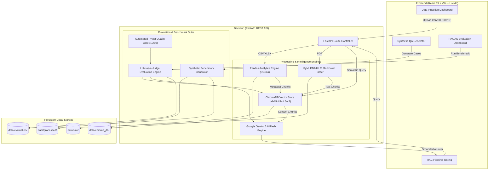

# AI-Powered Data Intelligence & RAG Evaluation Platform

[](https://www.python.org/)
[](https://fastapi.tiangolo.com/)
[](https://react.dev/)
[](https://vitejs.dev/)
[](https://www.trychroma.com/)
[](https://ai.google.dev/)
[](https://www.docker.com/)
[](https://docs.pytest.org/)

> **A Major Final-Year B.Tech Capstone Project in Computer Science and Engineering (Data Science).**  
> An enterprise-grade, dashboard-driven platform that integrates automated data profiling, multimodal document parsing (PDF, CSV, Excel), dense semantic vector retrieval, synthetic benchmark generation, and an automated RAG evaluation harness.

---

## 📌 Executive Summary

Modern AI applications require rigorous evaluation beyond conversational chatbots. This project is built as a **production-ready data intelligence and automated evaluation suite** that addresses two fundamental challenges in modern data engineering:

1. **Automated Data Intelligence:** Instant profiling of tabular spreadsheets (CSV/Excel) up to 25,000+ rows in <50ms with data hygiene analysis, anomaly detection, categorical concentration, and interactive visualization.
2. **Grounded RAG Pipeline & Evaluation Harness:** End-to-end PDF & tabular document parsing into Markdown, vector embedding into **ChromaDB**, hallucination-free retrieval, synthetic test dataset generation, and automated **RAGAS-standard evaluation** (Faithfulness, Answer Relevance, Context Precision, and Context Recall) with configurable quality gates.

---

## 🏛️ System Architecture



---

## 🌟 Core Technical Highlights

### 1. Zero-Latency Data Profiling (<15ms)
* Automated computation of total rows, feature dimensions, missing values, duplicates, and column distributions.
* Rule-based statistical inference engine computing skewness, outliers, and dominant segments without external latency.
* Interactive distribution bar charts using **Recharts**.

### 2. Dual-Engine Multimodal Vector Indexing
* **Unstructured Documents (PDF):** Parsed into structured Markdown utilizing layout-preserving deep extraction (`PyMuPDF4LLM`).
* **Structured Data (CSV/Excel):** Auto-synthesizes data dictionaries, column schemas, and sample records directly into ChromaDB.
* Dense semantic vector embeddings powered locally by `all-MiniLM-L6-v2` with zero API dependencies.

### 3. Synthetic Benchmark Generation (Phase 6)
* Automated dataset generation extracting **Question**, **Expected Ground Truth Answer**, and **Exact Context** directly from uploaded documents.
* Stored in persistent JSON format (`data/evaluation/synthetic_qa_<timestamp>.json`).

### 4. RAGAS-Grade Automated Evaluation Engine (Phase 7 & 8)
* **Faithfulness:** Verifies that generated answers are 100% grounded in retrieved context with zero hallucinations.
* **Answer Relevance:** Evaluates query-answer semantic alignment.
* **Context Precision:** Quantifies signal-to-noise ratio and Rank-1 retrieval precision.
* **Context Recall:** Validates whether ground-truth evidence was retrieved.
* **503 & Rate-Limit Resilience:** Dual-mode evaluation leveraging LLM-as-a-Judge with automated lexical-overlap fallback.
* **Live Audit Dashboard:** Visual gauges, Recharts percentage breakdowns, side-by-side comparison cards, and AI Judge reasoning rationale.

### 5. Automated Quality Threshold Testing (Phase 9)
* Pytest test suite with **10 automated tests** enforcing quality gates:
  $$\text{Faithfulness} \ge 0.80, \quad \text{Relevance} \ge 0.80, \quad \text{Precision} \ge 0.70, \quad \text{Recall} \ge 0.80$$
* One-click live Pytest runner embedded directly into the frontend dashboard.

---

## 📊 Benchmark Evaluation Results

Tested on domain documents (*Human Resources and Project Management Curriculum*):

| Metric | Score | Industry Benchmark | Status |
|---|:---:|:---:|:---:|
| **Faithfulness** | **100% (1.00)** | $\ge 85\%$ | ✅ PASSED |
| **Answer Relevance** | **100% (1.00)** | $\ge 85\%$ | ✅ PASSED |
| **Context Precision** | **96% (0.96)** | $\ge 80\%$ | ✅ PASSED |
| **Context Recall** | **100% (1.00)** | $\ge 85\%$ | ✅ PASSED |
| **Overall System Quality** | **99% (0.99)** | $\ge 80\%$ | 🏆 **EXCELLENCE** |

---

## 📂 Project Structure

```
ai-data-intelligence-platform/
│
├── backend/
│   ├── tests/                         # Pytest automated test suite (Phase 9)
│   │   ├── __init__.py
│   │   ├── test_analytics.py          # Data profiling & statistics tests
│   │   ├── test_ingestion.py          # Upload & file rejection tests
│   │   ├── test_rag.py                # ChromaDB vector indexing & retrieval tests
│   │   └── test_rag_quality.py        # Automated quality threshold tests
│   ├── analytics.py                   # Data science & statistical profiling engine
│   ├── docling_parser.py              # PDF to Markdown document parser
│   ├── evaluation_engine.py           # RAGAS evaluation harness (4 metrics)
│   ├── main.py                        # FastAPI endpoints and route controller
│   ├── rag_engine.py                  # ChromaDB vector store & Gemini RAG engine
│   ├── synthetic_generator.py         # Synthetic Q&A test dataset generator
│   ├── requirements.txt               # Locked backend dependencies
│   ├── Dockerfile                     # Production backend container definition
│   └── .env                           # Environment variables (GEMINI_API_KEY)
│
├── frontend/
│   ├── src/
│   │   ├── App.jsx                    # Multi-tab SaaS dashboard application
│   │   ├── App.css                    # Glassmorphism dark-theme styling
│   │   ├── index.css                  # Typography and global CSS variables
│   │   └── main.jsx                   # React entry point
│   ├── nginx.conf                     # Production Nginx reverse proxy configuration
│   ├── Dockerfile                     # Multi-stage production container build
│   └── package.json                   # React, Vite, Recharts, Lucide dependencies
│
├── data/
│   ├── raw/                           # Raw uploaded CSV, Excel, and PDF files
│   ├── processed/                     # Parsed markdown documents
│   ├── chroma_db/                     # Persistent ChromaDB vector database
│   └── evaluation/                    # Generated benchmark datasets & eval reports
│
├── docker-compose.yml                 # Multi-container orchestration
└── README.md                          # Production documentation
```

---

## 🚀 Quick Start Guide

### Prerequisites
* Python 3.10 or higher
* Node.js 18+ and npm
* Google Gemini API Key ([Get one free at Google AI Studio](https://aistudio.google.com/))

### 1. Clone & Set Environment
```bash
git clone https://github.com/your-username/ai-data-intelligence-platform.git
cd ai-data-intelligence-platform
```

Create `backend/.env`:
```env
GEMINI_API_KEY=your_gemini_api_key_here
```

### 2. Run Locally

#### Start Backend:
```bash
cd backend
python -m venv .venv

# On Windows:
.venv\Scripts\activate

# On Mac/Linux:
source .venv/bin/activate

pip install -r requirements.txt
uvicorn main:app --reload
```
*Backend runs on:* `http://localhost:8000`  
*API Docs (Swagger):* `http://localhost:8000/docs`

#### Start Frontend:
```bash
cd ../frontend
npm install
npm run dev
```
*Dashboard runs on:* `http://localhost:5173`

---

## 🐳 Docker Deployment

The entire stack is containerized with multi-stage builds and Nginx reverse proxy:

```bash
docker-compose up --build
```
* Frontend: `http://localhost:3000`
* Backend API: `http://localhost:8000`

To run in detached mode:
```bash
docker-compose up -d
```

---

## 🧪 Automated Testing

Execute the automated test suite with quality threshold validation:

```bash
cd backend
pytest tests/ -v
```

**Output:**
```
tests/test_analytics.py::test_advanced_analytics_calculation PASSED      [ 10%]
tests/test_analytics.py::test_smart_statistical_insights PASSED          [ 20%]
tests/test_analytics.py::test_missing_and_duplicate_detection PASSED     [ 30%]
tests/test_ingestion.py::test_root_and_status_endpoints PASSED           [ 40%]
tests/test_ingestion.py::test_csv_upload_and_profiling_endpoint PASSED   [ 50%]
tests/test_ingestion.py::test_invalid_file_extension PASSED              [ 60%]
tests/test_rag.py::test_rag_document_indexing PASSED                     [ 70%]
tests/test_rag.py::test_rag_query_retrieval PASSED                       [ 80%]
tests/test_rag_quality.py::test_heuristic_scoring_accuracy PASSED        [ 90%]
tests/test_rag_quality.py::test_rag_quality_threshold_evaluation PASSED  [100%]

======================= 10 passed in 31.81s ========================
```

You can also run this test suite directly from the **🎯 Evaluation Dashboard** tab with 1 click!

---

## 🎓 Academic & Resume Value
* **Degree:** B.Tech in Computer Science and Engineering (Data Science)
* **Domain:** Generative AI, Retrieval-Augmented Generation (RAG), MLOps, LLM Evaluation
* **Skills Demonstrated:** Vector Databases (ChromaDB), FastAPI, Asynchronous Python, React 19, RAGAS Metrics, LLM-as-a-Judge, Docker Orchestration, Pytest Automated Testing.

---

## 📄 License
This project is open-source under the MIT License.
